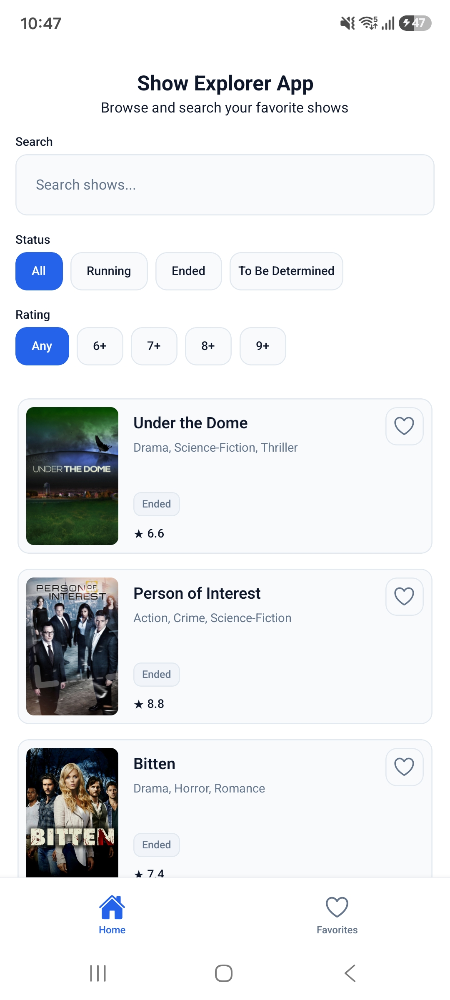
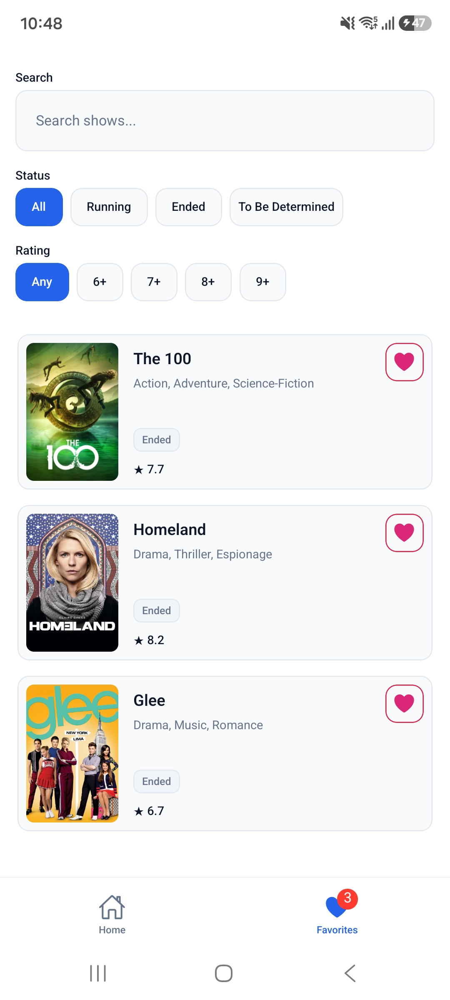
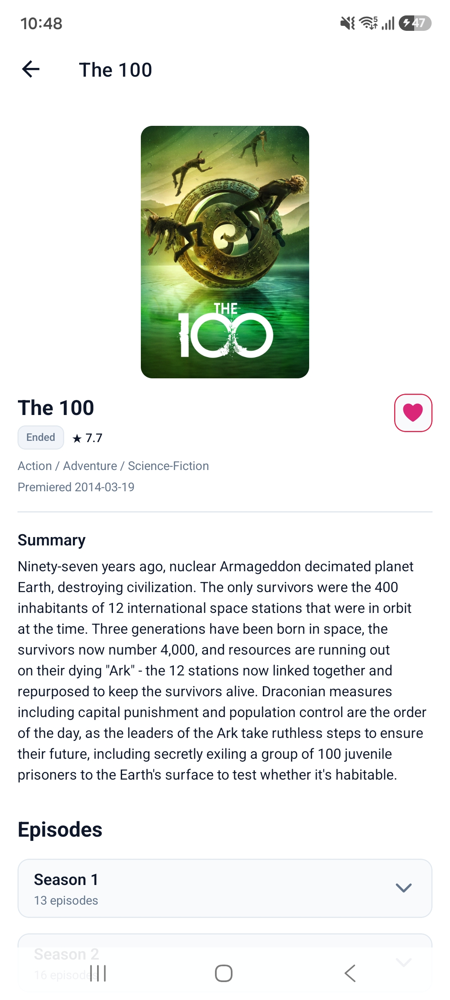
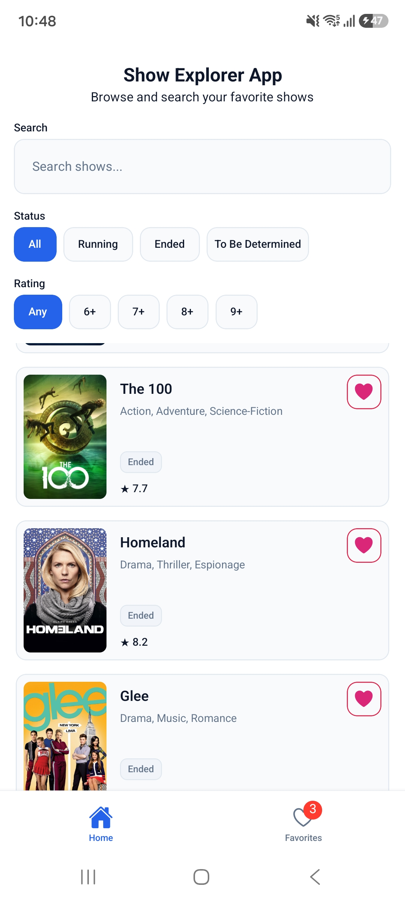

# Show Explorer

Show Explorer is a React Native/Expo application for discovering TV shows with the public TVMaze API, viewing show details and episodes, and managing a persistent local favorites collection.

## Features

- Paginated TV show discovery from TVMaze.
- Debounced remote search by show name.
- Status and minimum-rating filters.
- Optimized show lists with FlashList.
- Show detail pages with image, metadata, genres, rating, premiere date, and sanitized summary text.
- Episodes loaded independently from show details.
- Episodes grouped by season with collapsible season sections.
- Persistent favorites with a reactive favorites count.
- Local Favorites search and filtering.
- Intentional loading, skeleton, error, and empty states.

## Screenshots

| Home Screen                                                        | Favorites Screen                               | Show Details                               |
| ------------------------------------------------------------------ | ---------------------------------------------- | ------------------------------------------ |
|                                |  |  |
| Browse and search shows with status and rating filters             | Manage your saved favorite shows               | View show details, summary, and episodes   |
|  |                                                |                                            |
| Home screen showing favorites badge count                          |                                                |                                            |

## Tech Stack

- Expo / React Native: mobile app runtime and development workflow.
- TypeScript: strict static typing with `noUncheckedIndexedAccess`.
- Expo Router: file-based stack and tab navigation.
- TanStack Query: TVMaze-backed server state, caching, retries, and pagination.
- AsyncStorage: favorites persistence.
- NativeWind: utility styling over semantic design tokens.
- FlashList: performant long show collections.
- expo-image: remote show image rendering.
- Jest and React Native Testing Library: unit and component behavior coverage.

## Architecture

The app uses a feature-based architecture with explicit ownership boundaries:

- TVMaze remote state belongs to TanStack Query.
- Favorites client state belongs to `FavoritesProvider`.
- AsyncStorage is persistence, not reactive state.
- Search and filter state is screen-local.
- DTOs are mapped into domain models before reaching UI.

For deeper detail, see [Specification](docs/SPEC.md), [Architecture](docs/ARCHITECTURE.md), and [Decisions](docs/DECISIONS.md).

## Project Structure

```text
src/
|-- app/                  # Expo Router composition
|-- components/ui/        # shared domain-agnostic primitives
|-- features/
|   |-- shows/            # TVMaze show, episode, query, and presentation logic
|   `-- favorites/        # persisted favorite state, storage, and UI
|-- hooks/                # generic hooks
|-- lib/                  # API, storage, and query infrastructure
|-- providers/            # application provider composition
`-- theme/                # design tokens used from TypeScript
```

## Data Flow

Remote show data crosses a clear boundary before presentation:

```text
TVMaze API
    |
HTTP client
    |
feature API
    |
DTO mapper
    |
domain model
    |
TanStack Query
    |
UI
```

Browse and search use different TVMaze endpoint shapes, but both normalize into the same internal show model before the UI consumes them.

## Favorites Architecture

Favorites are small persistent client state, so they intentionally do not use Zustand, Redux, or TanStack Query.

```text
AsyncStorage
    |
favorites storage boundary
    |
FavoritesProvider
    |
useFavorites
    |
reactive UI
```

Favorites persist a minimal show snapshot, which lets the Favorites screen render, search, and filter locally without reconstructing every saved show from the network.

## Requirements

- Node.js 22.13.x or newer compatible with Expo SDK 57.
- npm.
- An Expo-compatible development environment.
- Android/iOS simulator, physical device with Expo Go, or web runtime for supported flows.

## Installation

```bash
npm install
```

## Running

```bash
npm start
npm run android
npm run ios
npm run web
```

## Quality Commands

```bash
npm run format:check
npm run lint
npm run typecheck
npm run test:ci
npm run test:coverage
```

`format:check` verifies Prettier formatting, `lint` runs Expo ESLint, `typecheck` runs TypeScript without emitting files, and the test commands run Jest in CI and coverage modes.

## Testing Strategy

The test suite focuses on observable behavior and stable boundaries:

- DTO mapping and defensive normalization.
- API boundary behavior.
- TanStack Query hooks for browse, search, detail, and episodes.
- Pure filtering, local favorite search, summary sanitization, and episode grouping.
- Favorites storage and provider behavior.
- Component behavior for controls, favorites, lists, empty/error states, and accessible accordion state.

The project does not include device-level E2E automation in the current scope.

## Design Decisions

Important decisions include:

- Feature-based architecture keeps Shows and Favorites responsibilities local.
- TanStack Query owns TVMaze server state.
- Favorites use Context plus AsyncStorage instead of a global state library.
- Favorite snapshots are persisted so Favorites can render without remote reconstruction.
- Home search is remote, while Favorites search is local.
- Status and rating filters apply to the currently available client-side dataset.
- Show detail and episode queries remain independent so episode failures do not remove usable show information.
- FlashList is used for primary show collections.
- NativeWind semantic tokens keep styling consistent without adding a heavy UI framework.

See [Decisions](docs/DECISIONS.md) for the full rationale.

## Trade-offs

- Home filters apply to the currently acquired browse or search dataset rather than the entire TVMaze catalog.
- Favorite snapshots can become temporarily stale compared with the current TVMaze record.
- Show and episode summaries are sanitized into plain text rather than rendered as rich HTML.
- Episode rendering uses a simple collapsed season structure instead of a more complex nested virtualization approach.
- NativeWind v5 preview is intentionally used with the Expo SDK 57 setup.

## With More Time

- Add device-level E2E coverage for navigation and persistence flows.
- Expand offline behavior beyond persisted favorites.
- Add runtime DTO validation if API reliability requirements increase.
- Run accessibility testing on real devices.
- Add visual regression tests for important loading, empty, and detail states.
- Profile long-list and large-season rendering on lower-end devices.

## AI-Assisted Development

AI tooling was used to assist with architecture discussion, specification refinement, task decomposition, implementation support, test generation/review, and documentation review.

AI-assisted changes were still reviewed against the repository specification, architectural decisions, TypeScript, linting, automated tests, and manual code inspection.
